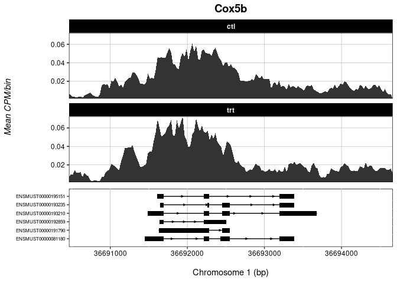
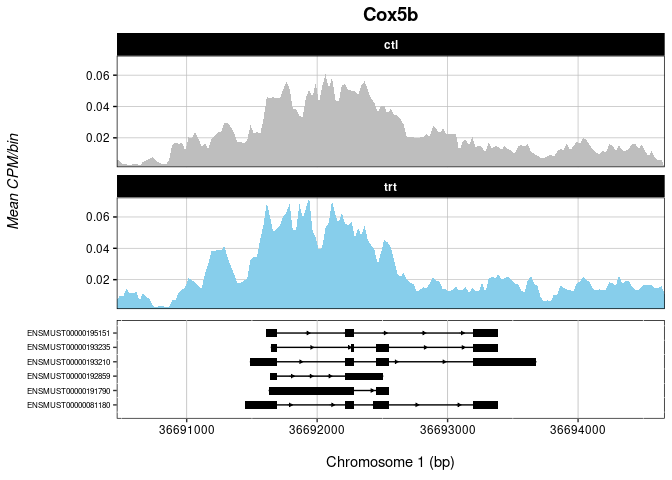
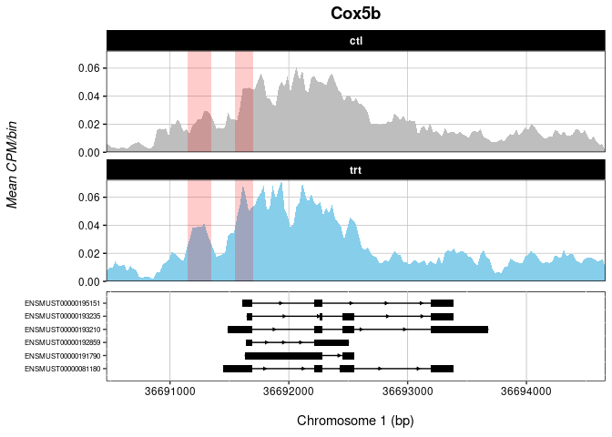

Making Peak Tracks from ChromDicts
================
Kat Lande
2026-05-13

Peak tracks can be a challenge to generate with versitility at
publicaiton quality. Here, I demonstrate how the chromDict objects from
PCBS can be used to make peak tracks in ggplot with a high degree of
memory efficiency. The first few steps of this process do take a while,
but once the files are set up, it is very fast.

<h2 align="center">Preparing Data from BAM</h2>

We start by getting binned counts from each bam file with deeptools.
This works in base on older IGC blades:

``` bash
multiBamSummary bins \
  --bamfiles *.target.markdup.sorted.bam \
  --outRawCounts Summary.bed \
  --binSize 25 \
  -p 24 # number of threads to use
```

Once you have a bed file, you can use it to generate chromDicts in R.
How you set up the chromDicts depends on how you want to display your
tracks. For example, if you want to plot an average across your
conditions, you can make one chromDict per condition as below. However,
the same logic applies if you want to make one chromDict per sample.

``` r
library(ggplot2)
library(ggpubr)
library(dplyr)
library(PCBS)
library(data.table)

# Read in your bed file:
bed <- read.delim("Summary.bed")
# modify the column names to remove extraneous text:
colnames(bed) <- gsub("\\.target\\.markdup\\.sorted\\.bam", "", colnames(bed))
colnames(bed) <- gsub("X\\.", "", colnames(bed))
colnames(bed) <- gsub("\\.", "", colnames(bed))
colnames(bed)[1:2] <- c("chr", "pos")
bed <- bed[-c(3)] # remove "end" position column
# normalize each sample by coverage:
bed[3:8] <- apply(bed[3:8], 2, function(x){(as.numeric(x)/sum(as.numeric(x)))*1e06}) 
```

To convert the BED data to an indexed chromDict, use the modified
[ChromDictAny()](https://github.com/katlande/IGC_SOPs/blob/main/Whole_Genome_Epigenetics.md)
function:

``` r
chromDictAny <- function(mat, IDs=NULL, multiple.samples=T, remove.extra=T, n.autosome=22){
  
  # set first two column names to "chr" and "pos"
  colnames(mat)[1:2] <- c("chr", "pos")
  
  if(multiple.samples){
     message("Calculating mean value differences...")
    if(length(IDs) == 1){
      mat$value <- rowMeans(mat[which(grepl(IDs, colnames(mat)))])
    } else {
      mat$value <- rowMeans(mat[which(colnames(mat) %in% IDs)])
    }
  
  } else {
    message(paste("Extracting values for sample:", IDs))
    if(length(IDs) > 1){
      warning("Cannot have multiple IDs when multiple.samples=FALSE!")
      stop()
    }
    # VAL column is just the column of interest
     mat$value <- mat[[which(colnames(mat) == IDs)]]
  }
  
  # create a master data.frame of bp chrom, pos, and value:
  mat$cpgID <- paste0(mat$chr, ":", mat$pos)
  row.names(mat) <- mat$cpgID
  diffdf <- mat[, c("chr", "pos", "value")]
  
   # if specified, remove any contig or chromosome other than autosomes and sex chromosomes. Note that this will NOT WORK in genome versions that use abnormal chromosome nomenclature, and is designed for human and mouse: 
  if(remove.extra){
    allchrnames <- unique(diffdf$chr)
    allchrnames_strip <- gsub("chr", "", allchrnames, ignore.case = TRUE)
    keep.chrnames <- allchrnames[which(allchrnames_strip %in% c(1:n.autosome, "x", "y", "X", "Y"))]
    # only subset if there are actually chromosomes present to remove:
    if(! identical(allchrnames, keep.chrnames)){
      message(paste("Removing", (length(allchrnames)-length(keep.chrnames)), "abnormal chromosomes/contigs..."))
      diffdf <- subset(diffdf, chr %in% keep.chrnames)
    } else {
      message("No abnormal chromosomes/contigs found!")
    }
  }
  
  # split by chromosome and order+index with data.table
  outlist <- list()
  message("Splitting by chromosome...")
  for(i in unique(as.character(diffdf$chr))){
    message(i)
    d <- diffdf[diffdf$chr==i,]
    d$pos <- as.numeric(d$pos)
    d <- d[order(d$pos),]
    data.table::setDT(d)
    data.table::setkey(d,pos)
    outlist <- append(outlist, list(d))
  }
  
  names(outlist) <- unique(as.character(diffdf$chr))
  return(outlist)
}
```

In this example, we’ll make two separate chromDicts containing the
average value across two n=3 conditions:

``` r
trt_dict <- chromDictAny(bed, IDs=c("trt1", "trt2", "trt3"), multiple.samples=T, n.autosome=19)
ctl_dict <- chromDictAny(bed, IDs=c("ctl1", "ctl2", "ctl3"), multiple.samples=T, n.autosome=19)

# SAVE chromDicts as they take a long time to generate:
saveRDS(trt_dict, "trt_ChromDict.rds")
saveRDS(ctl_dict, "ctl_ChromDict.rds")
```

<h2 align="center">Making Peak Tracks in R</h2>

Once chromDicts have been generated, creating peak tracks is simple. The
two functions below can be used to generate peak tracks of specific
genes from chromDicts using a gtf to identify gene loci:

``` r
# nested function to pull data from chromDicts:
MakeGeneData <- function(chromDictList, c, s, e){
  
  for(i in 1:length(chromDictList)){
    chromDict <- chromDictList[[i]]
    tmp <- chromDict[[c]]
    tmp <- na.omit(tmp[ .( c(s:e) ) ])
    tmp$Set <- names(chromDictList)[i]
    if(exists("OUTPUTFILE")){
      OUTPUTFILE <- rbind(OUTPUTFILE, tmp)
    } else {
      OUTPUTFILE <- tmp
    }
  }
  return(OUTPUTFILE)
}

# mega-function to plot the tracks:
makeTrack <- function(DictList, gtf, gene, annotation_bed=NULL, rel=4, cols=NULL,
                      has.chr=T, meta=NULL, facet=T, include.all.annotations=F){
  
  message("Extracting gene information")
  tmp_gtf <- subset(gtf, V3 %in% c("gene", "transcript", "exon") & grepl(paste0(gene, ";"), V9))
  if(nrow(tmp_gtf)==0){
    warning(paste("No gene named", gene, "present in gtf! Maybe it has another name?"))
  }
  tmp_gtf$V9 <- gsub("\\;.*", "", gsub(".*transcript_id", "", tmp_gtf$V9))
  tmp_gtf$ypos <- as.numeric(factor(tmp_gtf$V9))
  
  message("Pulling values across gene body...")
  c <-ifelse(has.chr,  paste0("chr",tmp_gtf$V1[tmp_gtf$V3 == "gene"][1]),  tmp_gtf$V1[tmp_gtf$V3 == "gene"][1])
  s <- tmp_gtf$V4[tmp_gtf$V3 == "gene"][1]-1000
  e <- tmp_gtf$V5[tmp_gtf$V3 == "gene"][1]+1000
  
  if(! is.null(annotation_bed) & include.all.annotations==T){
    s <- min(c(min(annotation_bed[[2]]), s))
    e <- max(c(max(annotation_bed[[3]]), e))
  }
  
  tmp_gtf <- subset(tmp_gtf, V3 %in% c("transcript", "exon"))
  input <- MakeGeneData(DictList, c=c, s=s, e=e)
  
  if(!is.null(meta)){
    message("Adding supplied meta data...")
    colnames(meta)[1:2] <- c("Set", "Fill")
    input <- merge(input, meta, by="Set", all.x=T)
  }
  
  # gene annotation
  message("Creating annotation track...")
  arrow_ticks <- subset(tmp_gtf, V3 == "transcript") %>%
    rowwise() %>%
    reframe(x= seq(V4, V5, length.out = 7)[2:6], y= ypos, strand = V7)
  
  ggplot(tmp_gtf)+
    scale_x_continuous(paste("\nChromosome", tmp_gtf$V1[1], "(bp)"), expand=c(0,0), limits=c(min(input$pos), max(input$pos)))+
    geom_segment(data=subset(tmp_gtf, V3 == "transcript"), 
                 mapping=aes(x=V4, xend=V5, y=ypos, yend=ypos))+
    geom_rect(data=subset(tmp_gtf, V3 == "exon"), 
              mapping=aes(xmin=V4, xmax=V5, ymax=ypos+0.25, ymin=ypos-0.3), 
              fill="black")+
    theme(panel.grid.major.y = element_blank(), 
          panel.grid.major.x = element_line(color="grey", linewidth = 0.3), 
          axis.text.y = element_text(colour = "black", size=6),
          axis.text.x = element_text(colour = "black"),
          panel.background = element_rect(fill="white", color="black"), axis.title.y = element_blank(), 
          plot.title=element_blank(),plot.margin = margin(0, 0, 0.25, 0, "cm"))+
    scale_y_continuous(labels=levels(factor(tmp_gtf$V9)), expand=c(0.1,0.1),
                       breaks=unique(tmp_gtf$ypos)[order(unique(tmp_gtf$ypos))])+
    geom_segment(data = arrow_ticks,
                 mapping = aes(x = x, y = y, yend = y,
                               xend = ifelse(strand == "+", x + diff(range(input$pos)) * 0.01,
                                             x - diff(range(input$pos)) * 0.01)),
                 arrow = arrow(length = unit(3, "pt"), type = "closed"),
                 linewidth = 0.2, color = "black")-> annotgrob
  
  # make peaks
  message("Creating peak track(s)...")
  if(ncol(input) == 4 & facet==T){
    ggplot(input, aes(x=pos))+
      geom_ribbon(ymin = 0, aes(ymax=value))+
      facet_wrap(~Set, nrow=length(unique(input$Set))) -> g
    
  } else if(ncol(input) > 4 & facet==T){
    
    if(is.null(cols)){
      cols <- colorRampPalette(c("skyblue", "darkgrey"))(length(unique(input$Fill)))
    }
    
    ggplot(input, aes(x=pos))+
      geom_ribbon(ymin = 0, aes(ymax=value, fill=Fill))+
      facet_wrap(~Set, nrow=length(unique(input$Set)))+
      scale_fill_manual(values=cols) -> g
    
  } else {
    ggplot(input, aes(x=pos))+
      geom_ribbon(ymin = 0, aes(ymax=value))-> g
  }
  
  g+
    Ol_Reliable()+
    theme(axis.text.x = element_blank(), axis.ticks.x = element_blank(),
          plot.title = element_text(hjust = 0.5, face="bold", size=14),
          axis.title.x = element_blank(), legend.position = "none")+
    ggtitle(gene)+
    scale_x_continuous(expand=c(0,0))+
    scale_y_continuous("Mean CPM/bin", expand=c(0,0)) -> trackgrob
  
  if(! is.null(annotation_bed)){
    # add annotations to the track:
    tmpdf <- annotation_bed[c(2:3)]
    tmpdf <- setNames(tmpdf, c("xs", "xe"))
    # remove peak annotations outside of range
    tmpdf <- subset(tmpdf, !xs > e & !xe < s)
    tmpdf$xs <- ifelse(tmpdf$xs < s, s, tmpdf$xs)
    tmpdf$xe <- ifelse(tmpdf$xe > e, e, tmpdf$xe)
    #
    tmpdf$ys <- 0
    tmpdf$ye <- Inf
    trackgrob+
      annotate(geom="rect", xmin=tmpdf$xs, xmax=tmpdf$xe, ymin=tmpdf$ys, ymax=tmpdf$ye, 
               color=NA, fill="red", alpha=0.2) -> trackgrob
  }

  outgrob <- ggpubr::ggarrange(trackgrob, annotgrob, heights = c(rel,1), align="v", ncol=1, nrow=2)
  return(outgrob)
}
```

We can use these functions as such:

``` r
# make a named list for each chromDict:
dictList <- list(trt=trt_dict, ctl=ctl_dict)

# read in a GTF -- this function is optimized for gtfs in ensembl format
gtf <- read.delim("/path/to/mm10.gtf", comment.char = "#", header=F)
```

<h3 align="center">A minimal peak track:</h3>

``` r
makeTrack(DictList=dictList, 
          gtf=gtf, 
          gene="Cox5b",
          rel=2)# relative height of peak track window to annotation track (i.e., 2:1)
```

<p align="center"></p>

<h3 align="center">Define colouration by a meta data variable</h3>

``` r
# make a supplemental meta data file:
trackMeta <- data.frame(v1=names(dictList), # names of input chromDicts
                        v2=c("treatment", "control")) # corresponding colouration variable
# this can be useful for more complex experiments whnere you want to colour e.g., 6 tracks by two conditions

makeTrack(DictList=dictList, 
          gtf=gtf, 
          gene="Cox5b", 
          rel=2,
          meta = trackMeta,
          cols=c("grey", "skyblue")) # optional custom colour specification
```

<p align="center"></p>


<h3 align="center">Highlight Specific loci</h3>

``` r
# If you want to highlight a specific position or positions on your track,
# you can supply a bed file containing loci, e.g., differential peaks:
annots <- data.frame(chr=c("chr1", "chr1"),
                     s=c(36691150, 36691550),
                     e=c(36691350, 36691700))

makeTrack(DictList=dictList, 
          gtf=gtf, 
          gene="Cox5b", 
          rel=2,
          meta = trackMeta,
          cols=c("grey", "skyblue"),
          annotation_bed = annots)
```
<p align="center"></p>

