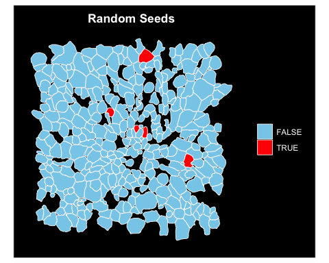
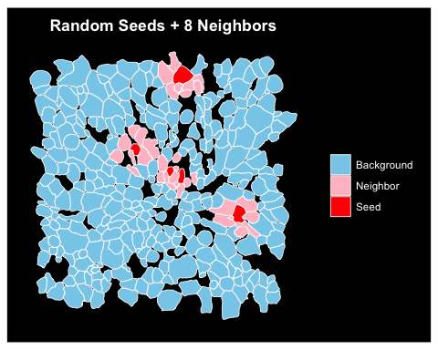
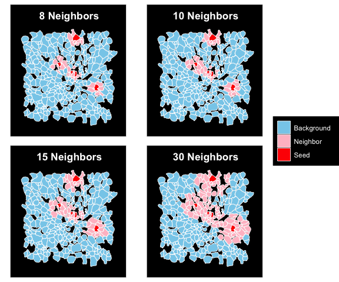
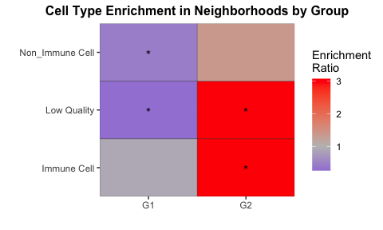
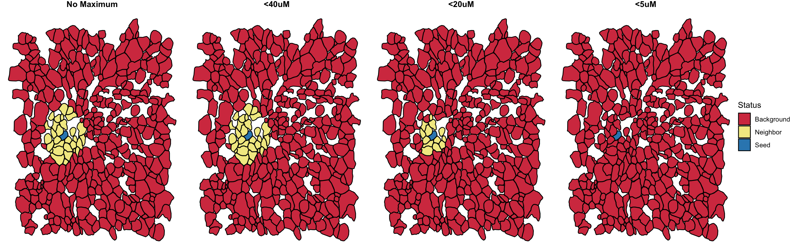

Finding Neighbors in Spatial Datasets
================
Kathryn Lande
2026-03-31

<h1 align="center">Load Libraries and Example Data</h1>

``` r
library(Seurat)
library(SeuratPlots)
library(ggplot2)
library(ggpubr)

# A small merfish example:
merfish <- readRDS("http://github.com/katlande/IGC_SOPs/tree/main/rds_assets/MERFISH_Test_Area.RDS") # download path
```

<h1 align="center">Identify Seed Cells</h1>

To identify neighbors, we first must define which cells we want to find
neighborhoods around. This can be anything: a specific cell type, cells
expressed a certain gene, etc. In this example, we’re just using some
randomly selected cells.

``` r
# Create a seed column where "seed" cells are TRUE and all other cells are FALSE
# Here we are using 5 randomly selected cells:
merfish$RandomCells <- ifelse(1:ncol(merfish) %in% sample(1:ncol(merfish), 5), TRUE, FALSE)

# Visualize our 5 random seeds using Seurat's ImageDimPlot():
ImageDimPlot(merfish, fov = "Test_FOV", group.by = "RandomCells", 
             cols = c(`FALSE`="skyblue", `TRUE`="red"))+
  theme(plot.title=element_text(hjust=0.5, face="bold"), 
        legend.title=element_blank())+ggtitle("Random Seeds") 
```

<p align="center"></p>

<h1 align="center">Identify Neighbors</h1>

We can identify neighbors using the K-nearest cells to each seed

``` r
# Find the closest neighbors to our random seed cells:
merfish <- findNeighbors(merfish, # input Seurat object
                         seed.col="RandomCells", # name of our seed column in the meta.data
                         nNeigh = 8) # use the 8 nearest cells

# Create a new column identifying seeds, neighbors, and background cells:
merfish$Status <- ifelse(merfish$RandomCells, "Seed", ifelse(merfish$isNeighbor, "Neighbor", "Background"))

# Plot neighborhoods:
ImageDimPlot(merfish, fov = "Test_FOV", group.by = "Status", 
             cols = c(Background="skyblue", Neighbor="pink", Seed="red"))+
  theme(plot.title=element_text(hjust=0.5, face="bold"), 
        legend.title=element_blank())+ggtitle("Random Seeds + 8 Neighbors") 
```

<p align="center"></p>

<h1 align="center">Modulating Neighborhood Size</h1>

We can increase or decrease the size of our neighborhoods with the
nNeigh setting. Optimal neighborhood sizes will depend on the study
system and tissue makeup.

``` r
# Neighbor with k=8
merfish <- findNeighbors(merfish, seed.col="RandomCells", nNeigh = 8, neighborCol = "Neighbor_8")
merfish$Status_8 <- ifelse(merfish$RandomCells, "Seed", ifelse(merfish$Neighbor_8, "Neighbor", "Background"))

# Neighbor with k=10
merfish <- findNeighbors(merfish, seed.col="RandomCells", nNeigh = 10, neighborCol = "Neighbor_10")
merfish$Status_10 <- ifelse(merfish$RandomCells, "Seed", ifelse(merfish$Neighbor_10, "Neighbor", "Background"))

# Neighbor with k=15
merfish <- findNeighbors(merfish, seed.col="RandomCells", nNeigh = 15, neighborCol = "Neighbor_15")
merfish$Status_15 <- ifelse(merfish$RandomCells, "Seed", ifelse(merfish$Neighbor_15, "Neighbor", "Background"))

# Neighbor with k=20
merfish <- findNeighbors(merfish, seed.col="RandomCells", nNeigh = 30, neighborCol = "Neighbor_30")
merfish$Status_30 <- ifelse(merfish$RandomCells, "Seed", ifelse(merfish$Neighbor_30, "Neighbor", "Background"))

# plot each k-neighborhood:
ImageDimPlot(merfish, fov = "Test_FOV", group.by = "Status_8", 
             cols = c(Background="skyblue", Neighbor="pink", Seed="red"))+
  theme(plot.title=element_text(hjust=0.5, face="bold"), 
        legend.title=element_blank())+ggtitle("8 Neighbors") -> n8
ImageDimPlot(merfish, fov = "Test_FOV", group.by = "Status_10", 
             cols = c(Background="skyblue", Neighbor="pink", Seed="red"))+
  theme(plot.title=element_text(hjust=0.5, face="bold"))+ggtitle("10 Neighbors") -> n10
ImageDimPlot(merfish, fov = "Test_FOV", group.by = "Status_15", 
             cols = c(Background="skyblue", Neighbor="pink", Seed="red"))+
  theme(plot.title=element_text(hjust=0.5, face="bold"))+ggtitle("15 Neighbors") -> n15
ImageDimPlot(merfish, fov = "Test_FOV", group.by = "Status_30", 
             cols = c(Background="skyblue", Neighbor="pink", Seed="red"))+
  theme(plot.title=element_text(hjust=0.5, face="bold"))+ggtitle("30 Neighbors") -> n30

ggpubr::ggarrange(n8, n10, n15, n30, nrow=2, ncol=2, common.legend = T, legend="right")
```

<p align="center"></p>

<h1 align="center">Checking Neighborhoods for Enrichment</h1>

You may want to see if any cell types or other variables are enriched
within your neighborhoods. You can check with EnrichNeighbors():

``` r
enrichDF <- EnrichNeighbors(seuratObj = merfish, # input Seurat object
                            neighborCol = "Neighbor_30", # name of the meta.data column that defines cell neighborhood (boolean)
                            group.by="MajorCellType") # name of the meta.data column to use as the grouping variable

head(enrichDF)
```

    ##             Group enrichRatio nCells      pVal
    ## 1 Non-Immune Cell   0.6813725    141 0.1079041
    ## 2     Low Quality   1.0704055    149 0.8193807
    ## 3     Immune Cell   1.5808989     68 0.1140832

<h3 align="center">Sub-dividing Enrichment</h3>

You may also want to check a second variable; for example, looking at
cell type enrichment in multiple treatment groups. Here we model this
using a randomly defined variable “Group”:

``` r
# Make a new variable assinging some cells to group "G1" and others to group "G2"
merfish$Group <- c(rep("G1", 200), rep("G2", 158))

# Redo enrichment with 'Group' set as the 'split.by' variable:
enrichDF2 <- EnrichNeighbors(seuratObj = merfish, # input Seurat object
                            neighborCol = "Neighbor_30", # name of the meta.data column that defines cell neighborhood (boolean)
                            group.by="MajorCellType", # name of the meta.data column to use as the grouping variable
                            split.by = "Group") # enrichment will be split by group

head(enrichDF2)
```

    ##             Group Split enrichRatio nCells         pVal         pAdj
    ## 1 Non_Immune Cell    G1   0.4414925     84 5.246129e-03 0.0209845147
    ## 2     Low Quality    G1   0.2584696     74 4.546688e-05 0.0002728013
    ## 3     Immune Cell    G1   0.9137931     42 8.625218e-01 0.8625218323
    ## 4     Low Quality    G2   3.0575139     75 4.613736e-05 0.0002728013
    ## 5     Immune Cell    G2   3.0748663     26 8.012247e-03 0.0240367412
    ## 6 Non_Immune Cell    G2   1.3630075     57 3.554410e-01 0.7108819135

You can also visualize split enrichment results with ggplot:

``` r
ggplot(enrichDF2, aes(x=Split, y=Group, fill=enrichRatio))+
  geom_tile(colour="black")+
  scale_x_discrete("", expand=c(0,0))+
  scale_y_discrete("", expand=c(0,0))+
  geom_text(aes(label=ifelse(pAdj<=0.05, "*", "")), size=4, vjust=0.7)+
  scale_fill_gradient2("Enrichment\nRatio", low = "blue", mid="grey", high="red", midpoint=1)+
  ggtitle("Cell Type Enrichment in Neighborhoods by Group")+
  theme(plot.title=element_text(hjust=0.5, face="bold", size=12))
```
<p align="center"></p>

Here we see that low quality and immune cells are significantly enriched in G2 neighborhoods, whereas low quality and non-immune cells are significantly depleted from G1 neighborhoods. This is a random example where a significant enrichment was found for demonstration purposes.


<h3 align="center">Setting a Maximum Distance</h3>

In some tissues or experiments, exclusively using KNN to define neighborhoods may yeild very distant cells being called as neighbors. For example, in sparse tissues where a neighbor cell may be very far away, or in highly filtered tissues where many true cells are actually missing. In this case, we can explicitly set the maximum distance a cell can be from a seed before it is no longer considered a neighbor. This value will be based on whatever unit the coordinate system is based in (e.g., uM in MERFISH, px in CosMx, etc).

Here we see an example of KNN=30 around a singular seed cell, with maximum distances set to 40um, 20um, and 5um respectively:

```r
# New seed column with a single random seed:
merfish$RandomCell_1 <- ifelse(1:ncol(merfish) %in% sample(1:ncol(merfish), 1), TRUE, FALSE)

# no limit example:
merfish <- findNeighbors(merfish, seed.col="RandomCell_1", nNeigh = 30, neighborCol = "N_noDist")
merfish$N_noDist <- ifelse(merfish$RandomCell_1, "Seed", ifelse(merfish$N_noDist, "Neighbor", "Background"))
# max dist 40uM:
merfish <- findNeighbors(merfish, seed.col="RandomCell_1", nNeigh = 30, neighborCol = "N_40", max.dist = 40) 
merfish$N_40 <- ifelse(merfish$RandomCell_1, "Seed", ifelse(merfish$N_40, "Neighbor", "Background"))
# max dist 20uM:
merfish <- findNeighbors(merfish, seed.col="RandomCell_1", nNeigh = 30, neighborCol = "N_20", max.dist = 20) 
merfish$N_20 <- ifelse(merfish$RandomCell_1, "Seed", ifelse(merfish$N_20, "Neighbor", "Background"))
# max dist 5uM:
merfish <- findNeighbors(merfish, seed.col="RandomCell_1", nNeigh = 30, neighborCol = "N_5", max.dist = 5) 
merfish$N_5 <- ifelse(merfish$RandomCell_1, "Seed", ifelse(merfish$N_5, "Neighbor", "Background"))

# plot with ImageDims with SeuratPlots:
coordDF_1 <- SeuratPlots::getPolygons(merfish, "Test_FOV")

# draw all plots:
plot_noDist <- PlotPolygons(coordDF_1, fillVar = "N_noDist", legend.name = "Status")+
  theme(plot.title = element_text(hjust=0.5, face="bold"))+ggtitle("No Maximum")
plot_40 <- PlotPolygons(coordDF_1, fillVar = "N_40", legend.name = "Status")+
  theme(plot.title = element_text(hjust=0.5, face="bold"))+ggtitle("<40uM")
plot_20 <- PlotPolygons(coordDF_1, fillVar = "N_20", legend.name = "Status")+
  theme(plot.title = element_text(hjust=0.5, face="bold"))+ggtitle("<20uM")
plot_5 <- PlotPolygons(coordDF_1, fillVar = "N_5", legend.name = "Status")+
  theme(plot.title = element_text(hjust=0.5, face="bold"))+ggtitle("<5uM")

ggarrange(plot_noDist,plot_40,plot_20,plot_5, nrow=1, ncol=4, align="hv", common.legend = T, legend="right")

```

<p align="center"></p>


