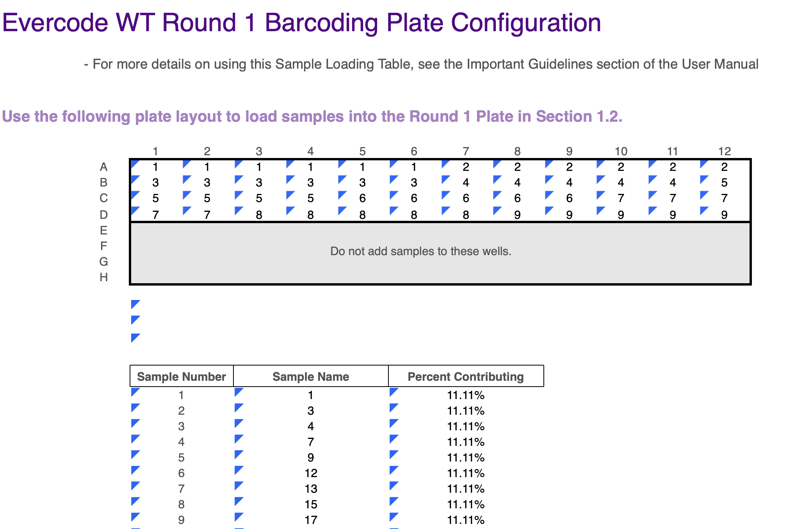

Parse Alignment with Split-Pipe
================

**This is an SOP for Parse-seq alignment on Cask written in May 2026.
Newer versions of Split-pipe may be required going forward.**

# Setting up a Split-Pipe run

To align data from a parse experiment, you will need to set up a
samp-list file based on the plate loading table, which looks like this:

<p align="center"></p>


The samp-list needs to assign
wells to each sample, for example in the above, our samp-list would be:

``` bash
cat > sample_list.txt
S1 A1:A6
S2 A7:A12
S3 B1:B6
S4 B7:B11
S5 B12,C1:C4
S6 C5:C9
S7 C10:C11,D1:D2
S8 D3:D7
S9 D8:D12
```

To run split-pipe, open the spipe_1.7 conda environment and update the
\$PATH:

``` bash
conda activate spipe_v1.7
PATH=/vast/igc/tools/miniconda3/envs/spipe_v1.7/bin:$PATH
```

## Making a new reference for split-pipe

Existing parse references can be found in **/vast/igc/data/genomes/**
New references need to be made when split-pipe is updated. Here is a
mkref example for an updated version of the mm39 reference for
split-pipe v1.7:

``` bash
split-pipe \
--mode mkref \
--genome_name mm39 \
--fasta /gpfs/genomes/parse_genomes/Mus_musculus.GRCm39.dna.primary_assembly.fa.gz \
--genes /gpfs/genomes/parse_genomes/Mus_musculus.GRCm39.108.gtf.gz \
--output_dir /vast/igc/data/genomes/parse_genomes/mm39_1.7
```

## Run split-pipe alignment

``` bash
split-pipe \
--mode all \
--chemistry v3 \# Verify the correct chemistry is used
--kit WT \# Kit name can be found in the sample loading sheet
--kit_score_skip \
--fq1 /path/to/*_R1_001.fastq.gz \
--fq2 /path/to/*_R2_001.fastq.gz \
--output_dir /path/to/output \
--genome_dir /vast/igc/data/genomes/parse_genomes/mm39_1.7 \
--samp_list sample_list.txt \
--nthreads 16 \
--start_timeout 120
```

# Read split-pipe output into Seurat

To load parse data into Seurat, load in samples one at a time with the
following function:

``` r
library(Seurat)
library(ggplot2)
library(dplyr)
library(reshape2)
library(tibble)
library(ggpubr)
library(RColorBrewer)
library(SeuratPlots)

MakeParseObj <- function(path, mincellfrac=0.0005, mincellfeat=50){
  # 1. Read the sparse matrix
  counts <- readMM(paste0(path, "/DGE_filtered/count_matrix.mtx"))
  counts <- Matrix::t(counts)
  counts <- as(counts, "CsparseMatrix")
  
  # 2. Read gene and cell names
  genes <- read.csv(paste0(path, "/DGE_filtered/all_genes.csv"), stringsAsFactors = FALSE)
  cells <- read.csv(paste0(path, "/DGE_filtered/cell_metadata.csv"), stringsAsFactors = FALSE)
  
  # 3. Assign names to the matrix (ensure unique names)
  rownames(counts) <- genes$gene_name 
  colnames(counts) <- cells$bc_wells
  
  # Create an RNA assay:
  assay <- CreateAssayObject(counts, assay = "RNA", min.features = mincellfeat, min.cells = ceiling(nrow(cells)*mincellfrac))
  obj <- CreateSeuratObject(assay, meta.data = tibble::column_to_rownames(cells, "bc_wells"))
  
  return(obj)
}
```

You can then read in each sample like:

``` r
Obj_S1 <- MakeParseObj("/path/to/output/S1")
Obj_S2 <- MakeParseObj("/path/to/output/S1")
Obj_S3 <- MakeParseObj("/path/to/output/S3")
# etc...
```
