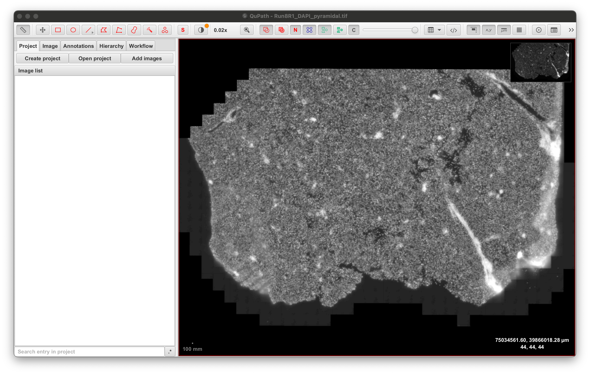
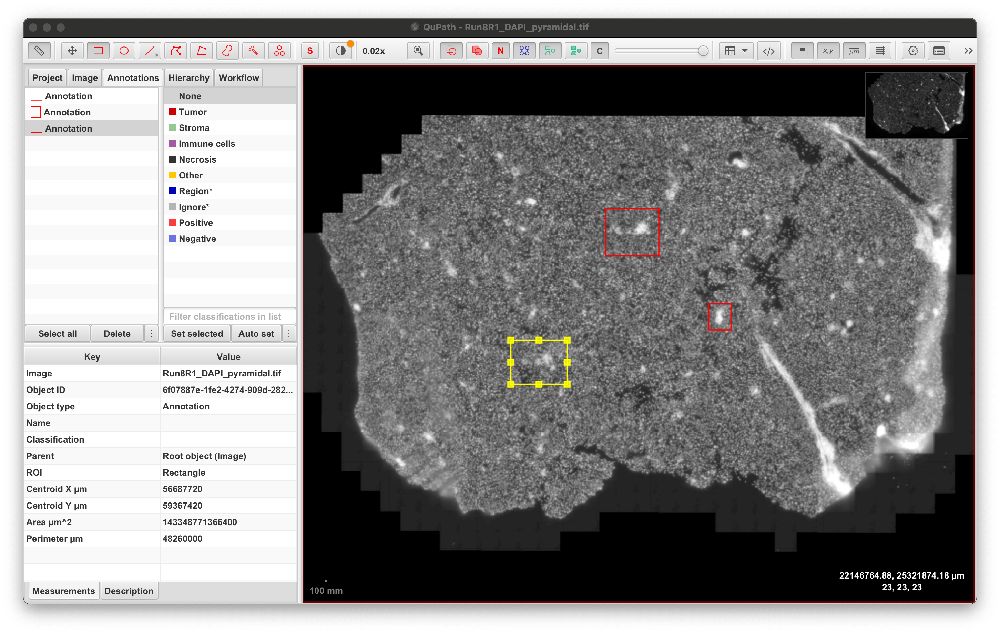
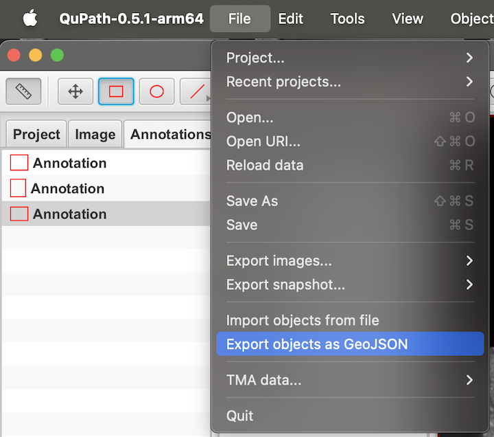
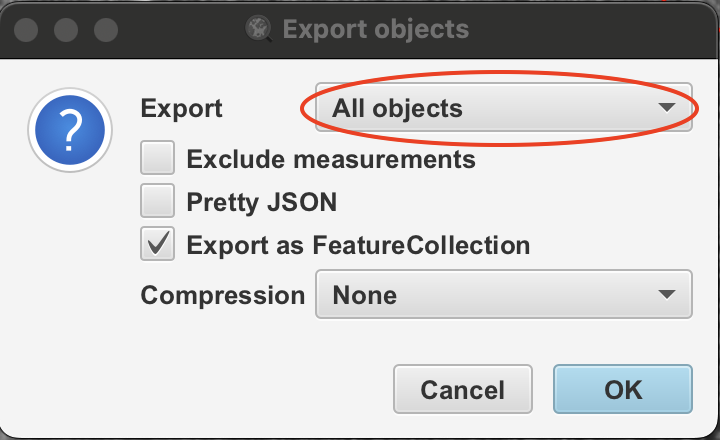

Selecting and Exporting MERFISH Areas
================
Kathryn Lande
2026-03-20

## Pre-process Raw Images

Raw MERFISH images can be upwards for 30gb. In their raw format, QuPath
does not handle them well. It’s best to convert them to a pyramidal
format with vips, which can be done on command line. This will also
shrink the total file size by \>10X.

``` bash

# image input and output paths
input="/path/to/dapi.tif"
output="/path/to/output/dapi_pyramidal.tif"

# On blades running the old conda (e.g., pilsner):
conda activate viptest
vips tiffsave $input $output --tile --pyramid --compression jpeg --Q 100

# On blades running the new conda (e.g., cask):
conda activate MFcropping
vips tiffsave $input $output --tile --pyramid --compression jpeg --Q 100
```

## Manually Select Regions

### (1) Open the pyramidal image in QuPath.



### (2) Annotate areas with the **rectangular** annotation tool (subsequent steps won’t work with non-rectangular annotations).



### (3) Export the annotations as a GEOJSON.



#### (4) Select “All objects” and save as a featurecollection.



## Convert GEOJSON to Plain Text Coordinates

GEOJSON format is not easily readable, but can be converted to a tsv
with x/y min/max columns with the shell script below:

``` bash
#!/usr/bin/env bash
set -euo pipefail

INPUT="$1"
OUTPUT="${2:-/dev/stdout}"

python3 - "$INPUT" > "$OUTPUT" << 'EOF'
import sys, json

filename = sys.argv[1]

with open(filename) as f:
    data = json.load(f)

print("polygon_id\txmin\txmax\tymin\tymax")

for i, feature in enumerate(data["features"]):
    coords = []

    geom = feature["geometry"]

    if geom["type"] == "Polygon":
        for ring in geom["coordinates"]:
            coords.extend(ring)

    elif geom["type"] == "MultiPolygon":
        for poly in geom["coordinates"]:
            for ring in poly:
                coords.extend(ring)

    xs = [p[0] for p in coords]
    ys = [p[1] for p in coords]

    print(f"{i}\t{min(xs)}\t{max(xs)}\t{min(ys)}\t{max(ys)}")
EOF
```

Save this code chunk as a .sh file and **run it within any conda
environment running python3**, such as base:

``` bash

bash GEOJSON_convert.sh /path/to/geojson.geojson /path/to/geojson.tsv
```

The resulting .tsv file contains x and y coordinates for each annotation
that should be compatible with your seurat object’s x and y coordinates
(although the x and y columns might be swapped in Seurat and you should
always confirm the angle manually).

``` r
annots <- read.delim("plaintext_assets/geojson.tsv")
head(annots)
```

    ##   polygon_id  xmin  xmax  ymin  ymax
    ## 1          0 19650 24986 21291 25455
    ## 2          1 28630 33640  8863 13287
    ## 3          2 38325 40472 17842 20315
