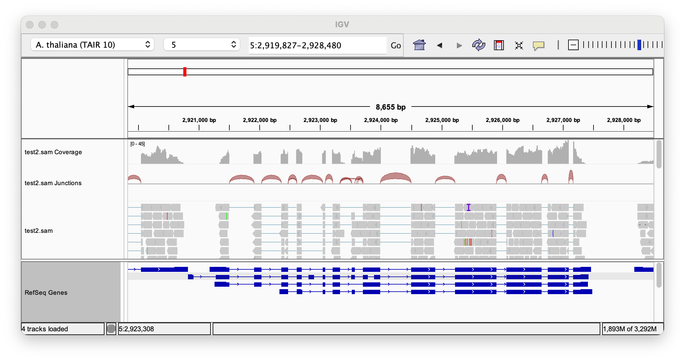
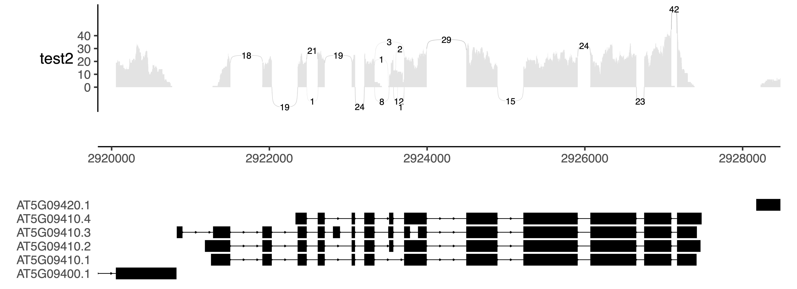
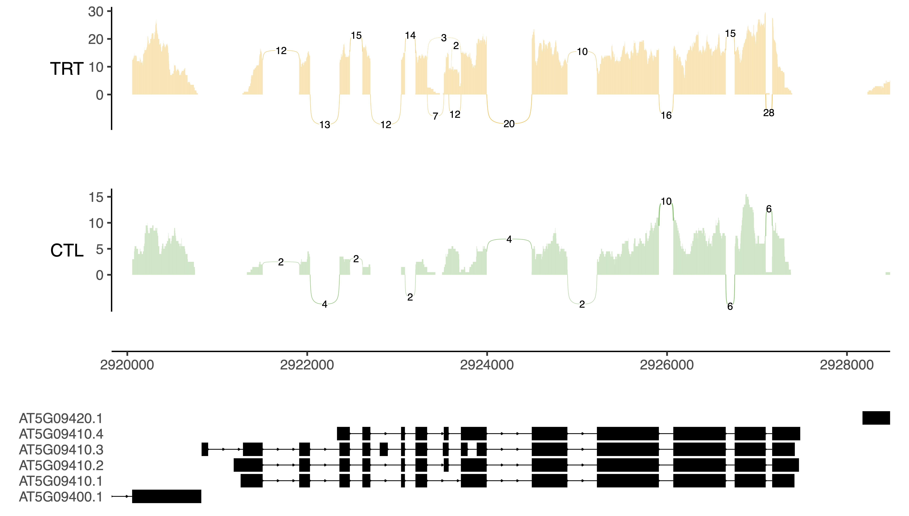

Estimating Alternative Splicing with Short Read RNAseq
================
Kathryn Lande
2026-04-02

<h1 align="center">Finding Splice Junctions</h1>

While it is best practices to use long read data for alternative
splicing analyses, it is possible to estimate splice fractions at
individual junctions with short read data by extracting genes of
interest from a bam file and looking at their alignment patterns.

<h2 align="center">Extracting Genes from Bam</h2>

``` bash

# Starting with our source file: test.bam

# Sort bam by position:
samtools sort -o test_sorted.bam test.bam
# Index sorted bam:
samtools index test_sorted.bam

# Check chromosome names in bam:
samtools idxstats test_sorted.bam | cut -f1
# Chr1
# Chr2
# Chr3
# Chr4
# Chr5
# ChrC
# ChrM
# *

# Create a bed file with positions of GOIs:
cat > GOI_loci.bed
Chr5    2919827 2928480
Chr5    25685193    25693339
Chr2    9470219 9477646
Chr1    25197182    25204126
Chr4    9147059 9154292
Chr3    5780418 5787310

# Subset regions of interest into a new sam
samtools view -h test_sorted.bam -L GOI_loci.bed > test_GOIs.sam

# In this case, the chromosomes need to be renamed to be compatable with IGV
# Remove "Chr" from sam header and sequences:
sed -e 's/SN:Chr/SN:/' test_GOIs.sam | sed -e 's/Chr//' > test_GOIs_final.sam
```

<h2 align="center">Checking Junctions in IGV</h2>

Filtered sam files can be directly loaded into IGV and checked manually,
Here we can see splice junctions at our first GOI.

<p align="center"></p>

Above, we can see some minor evidence of partial exon skipping (7th exon
of the first transcript variant).

IGV works great for spot-checking individual samples, but once we start
comparing replicates across conditions, we will want a more automated
method.

<h2 align="center">Making Sashimi Plots on Command Line</h2>

[ggsashimi](https://github.com/guigolab/ggsashimi) is a python-based
tool that uses bam files and a GTF to make sashimi plots over a
user-specific interval

``` bash
# convert back to bam and index:
samtools view -bS test_GOIs_final.sam > test2.bam
samtools index test2.bam

# pull the ggsashimi source code to your working directory:
wget https://raw.githubusercontent.com/guigolab/ggsashimi/master/ggsashimi.py

# use ggsashimi to make plots on command line
# note that if you don't need to rename the chromosomes,
# this can be done directly from the source bam file
# this works in BASE on pilsner

# Example for a single sample:
python ggsashimi.py \
  -b test2.bam \ # input bam file
  -c 5:2919827-2928480 \ # location of interest
  -g /path/to/TAIR10.gtf # GTF containing transcript versions
```

<p align="center"></p>

<h3 align="center">Multi-Sample Sashimi Plots</h3>

When looking at multiple samples, we can condense them by condition:

``` bash
# more complex examples:
python ggsashimi.py \
  -b plaintext_assets/bams.tsv \ # tsv containing sample name/bam path/annotation
  -c 5:2919827-2928480 \ # specify locus
  -M 2 \ # minimum number of reads per junction
  -C 3 \ # use the third column of bams.tsv to define colour
  -O 3 \ # overlay all samples by factor in the third column of bams.tsv
  -P plaintext_assets/colours.txt \ # newline-delimited txt file with colours to use
  --alpha 0.5 \ # alpha value for overlay
  -A mean \ # takes the mean n junctions for each group
  -g /path/to/TAIR10.gtf
```

<p align="center"></p>

Other than coverage differences between the two groups, we do not see
*much* evidence of alternative splice junctions being present between
conditions at AT5G09410. The exon-7 skipping we obeserved in IGV is
present in the TRT samples, but due to lower coverage in the CTL
samples, we didn’t pick up **any** junction-containing reads around this
region on average.

To see if we found any junction-containing reads in any sample, we can
set the minimum junction number to 1 and get the total counts from all
samples like this:

``` bash
# same as above, but with the -M and -A options removed
python ggsashimi.py \
  -b plaintext_assets/bams.tsv \ # tsv containing sample name/bam path/annotation
  -c 5:2919827-2928480 \ # specify locus
  -C 3 \ # use the third column of bams.tsv to define colour
  -O 3 \ # overlay all samples by factor in the third column of bams.tsv
  -P plaintext_assets/colours.txt \ # newline-delimited txt file with colours to use
  --alpha 0.5 \ # alpha value for overlay
  -g /path/to/TAIR10.gtf
```

<p align="center"></p>

Now, we can see some evidence of exon 7 inclusion in the CTL and no
evidence of skipped junctions. However, we only have a very small total
number of junctions in the CTL, so this should be taken with a big grain
of salt.
