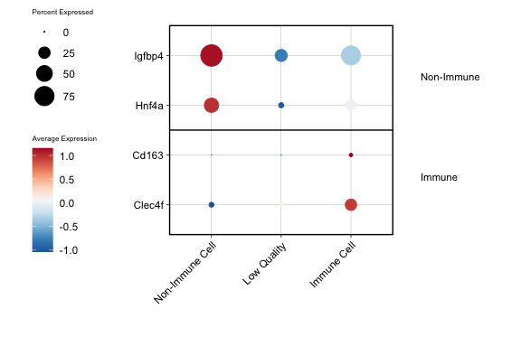
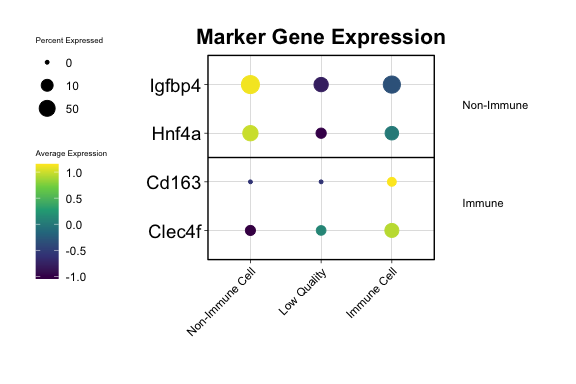
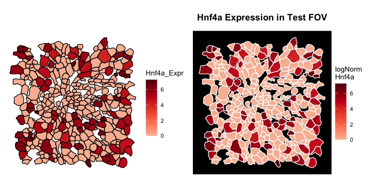
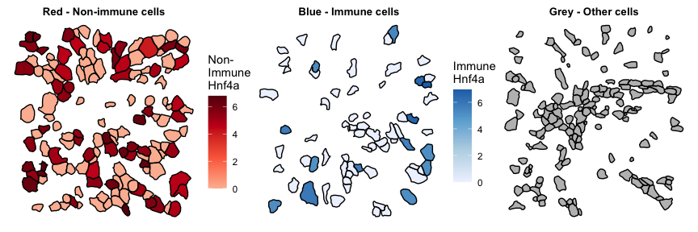
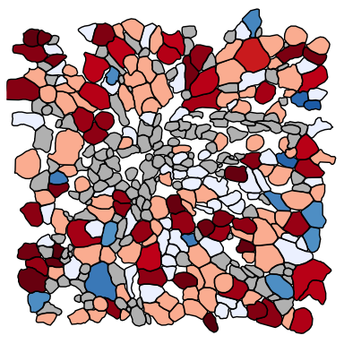
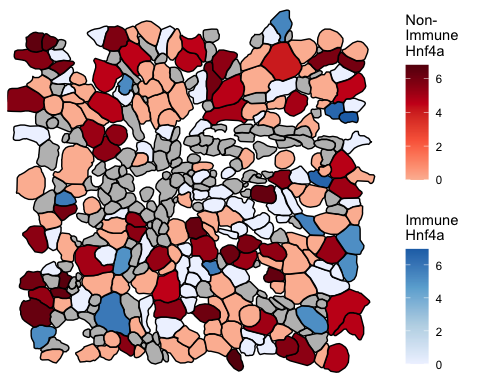
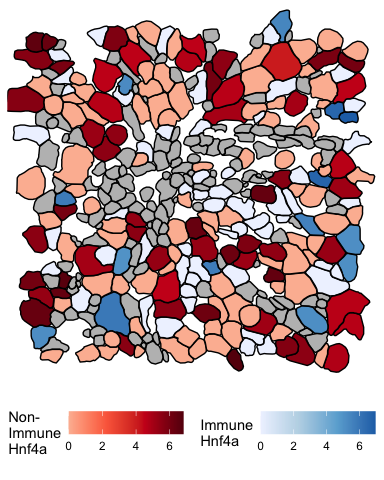

SeuratPlots
================
Kathryn Lande
2026-03-30

# Load Libraries and Example Data

``` r
# devtools::install_github("katlande/SeuratPlots") # If not already installed
library(SeuratPlots)
library(Seurat)
library(dplyr)
library(patchwork)
library(RColorBrewer)
library(ggpubr)
library(ggplot2)
```

Using a minimal MERFISH Seurat object with 1 FOV and 358 cells:

``` r
# Read in the test data:
merfish <- readRDS("MERFISH_Test_Area.RDS")

# check meta data:
head(merfish@meta.data)
```

    ##                      orig.ident nCount_RNA nFeature_RNA        x        y
    ## 4492993500033100125 Test_Sample         16           12 3103.451 1061.852
    ## 4492993500033100159 Test_Sample         13           10 3105.489 1068.209
    ## 4492993500033100170 Test_Sample         56           39 3097.155 1074.681
    ## 4492993500033100239 Test_Sample          7            7 3106.735 1085.630
    ## 4492993500033100269 Test_Sample          1            1 3115.562 1088.453
    ## 4492993500033100294 Test_Sample         19           16 3109.809 1095.021
    ##                       MajorCellType
    ## 4492993500033100125 Non-Immune Cell
    ## 4492993500033100159     Low Quality
    ## 4492993500033100170     Immune Cell
    ## 4492993500033100239     Low Quality
    ## 4492993500033100269     Low Quality
    ## 4492993500033100294 Non-Immune Cell

# Marker Plots

To help ID cell types, we can use the MarkerPlot() function, which is a
more flexible version of Seurat’s DotPlot() with annotation and
clustering options. A minimal version of this plot requires a Seurat
object and a two-column data frame with genes and their annotations.

``` r
# Make an annotation DF:
genesDF <-
  data.frame(Gene=c("Hnf4a", "Igfbp4", "Clec4f", "Cd163"),
             Annotation=c("Non-Immune", "Non-Immune", "Immune", "Immune"))

head(genesDF) # column names don't matter, but column order does.
```

    ##     Gene Annotation
    ## 1  Hnf4a Non-Immune
    ## 2 Igfbp4 Non-Immune
    ## 3 Clec4f     Immune
    ## 4  Cd163     Immune

``` r
# Marker plot uses the Idents() and DefaultAssay() of the Seurat object by default, and clusters Idents by similarity.
MarkerPlot(obj = merfish, # seurat object
           genes = genesDF, # gene+annotation dataframe
           margin_factor = 0.75, # margin size; increase/decrease if there's too little/too much space for the annotations
           maxsize = 8)  # maximum size for dots
```
<p align="center">
</p>

MarkerPlots are grobs, and can be easily modified using ggplot2()
parameters:

``` r
MarkerPlot(merfish, genesDF, margin_factor = 0.75, maxsize = 8)+
  scale_size_continuous(trans="sqrt", breaks=c(0,10,50))+ # transform dot sizes to a sqrt scale and reduce breaks 
  ggtitle("Marker Gene Expression")+ # add a title
  theme(axis.text.y=element_text(size=14), # increase y axis text size
        plot.title=element_text(size=16))+ # set title size
  scale_colour_viridis_c() # change the colour scale
```

<center></center>

# Flexible Feature Plots

Seurat’s basic ImageFeaturePlot() leaves a lot to be desired, especially
when it comes to value scaling and implementing more complex
visualizations. Here we show how to make a basic ImageFeaturePlot()
using expression of Hnf4a, as well as more complex versions of the plot
using multiple colour scales.

Extract polygon information for each cell in a given image to a new data
frame:

``` r
# Add Hnf4a expression to the meta.data:
merfish$Hnf4a_Expr <- FetchData(object = merfish, vars = "Hnf4a")[[1]]

# Extract polygon coordinates from an image:
poly <- getPolygons(merfish, "Test_FOV")
head(poly)
```

    ##                  cell polygonX polygonY  orig.ident nCount_RNA nFeature_RNA
    ## 1 4492993500033100159 3104.577 1073.838 Test_Sample         13           10
    ## 2 4492993500033100159 3105.435 1073.476 Test_Sample         13           10
    ## 3 4492993500033100159 3106.358 1071.961 Test_Sample         13           10
    ## 4 4492993500033100159 3106.967 1071.961 Test_Sample         13           10
    ## 5 4492993500033100159 3108.728 1071.124 Test_Sample         13           10
    ## 6 4492993500033100159 3109.265 1070.096 Test_Sample         13           10
    ##          x        y MajorCellType Hnf4a_Expr
    ## 1 3105.489 1068.209   Low Quality          0
    ## 2 3105.489 1068.209   Low Quality          0
    ## 3 3105.489 1068.209   Low Quality          0
    ## 4 3105.489 1068.209   Low Quality          0
    ## 5 3105.489 1068.209   Low Quality          0
    ## 6 3105.489 1068.209   Low Quality          0

Make a minimal feature plot. This function returns a grob that can be
modified with basic ggplot2 parameters as desired:

``` r
# Plot polygons with Hnf4a expression colouring:
basic_plot <- PlotPolygons(poly, "Hnf4a_Expr")

# Plot polygons with Hnf4a expression colouring:
modified_plot <-
  PlotPolygons(poly, "Hnf4a_Expr", legend.name = "logNorm\nHnf4a", border_color = "white")+
  theme(plot.title=element_text(hjust=0.5, size=14, face="bold"), 
        panel.border = element_rect(colour="black", fill=NA, linewidth=1),
        panel.background = element_rect(fill="black"),
        plot.margin = margin(t=0.5,r=0.5,b=0.5,l=0.5,unit = "cm"))+
  ggtitle("Hnf4a Expression in Test FOV\n")

# See plot versions side by side:
basic_plot + modified_plot
```

<center></center>

### Making Complex Feature Plots

We can also overlay multiple images, for example if we only want to
colour certain cell types and use different gradients:

``` r
# Make one plot for each 'layer' of the image:

# plot non-immune cells, coloured red by Hnf4a expression:
plot1 <- PlotPolygons(subset(poly, MajorCellType=="Non-Immune Cell"), "Hnf4a_Expr", legend.name = "Non-\nImmune\nHnf4a")+
  theme(plot.title=element_text(hjust=0.5, size=10, face="bold"))+
  ggtitle("Red - Non-immune cells")
# plot immune cells, coloured blue by Hnf4a expression:
plot2 <- PlotPolygons(subset(poly, MajorCellType=="Immune Cell"), "Hnf4a_Expr", legend.name = "Immune\nHnf4a", 
                      fillColor = brewer.pal(4, "Blues"))+
  theme(plot.title=element_text(hjust=0.5, size=10, face="bold"))+
  ggtitle("Blue - Immune cells")
# plot all other cells grey with no variable:
plot3 <- PlotPolygons(subset(poly,! MajorCellType  %in% c("Non-Immune Cell", "Immune Cell")), 
                      background="grey")+
  theme(plot.title=element_text(hjust=0.5, size=10, face="bold"))+
  ggtitle("Grey - Other cells") # colour all non-immune cells grey

# see all the plot layers side by side:
plot1 + plot2+ plot3
```

<center></center>

To make out complex plot, we need to stack these three plots on top of
each other.

To make sure all plot layers are lined up in the same orientation, use
the custom function ‘prepStack()’ to keep everything in line relative to
the limits of the “poly” dataframe. Note that prepStack() removes
legends, so legends need to be added back in retroactively:

``` r
# you can overlay as many plots as you wish using this function, as long as the bottom plot has first=TRUE
prepStack(plot3, poly, first=T)+ 
  prepStack(plot2, poly, first=F)+ 
  prepStack(plot1, poly, first=F) -> overlay

# Look at the overlay:
overlay
```

<center></center>

Add the immune and non-immune legends back in as separate grobs:

``` r
# combine both legends vertically:
legend_stack <- ggarrange(collectLegend(plot1),
                          collectLegend(plot2), nrow=2, ncol=1, align="hv")

# Then add them to the right of the overlay:
ggarrange(overlay, legend_stack, align="hv", nrow=1, ncol=2, widths=c(1, 0.25))
```

<center></center>

## Changing legend positions

You can also add you legends below the overlay with some small
modifications:

``` r
# create the original plots with legend="bottom"
plot1b <- PlotPolygons(subset(poly, MajorCellType=="Non-Immune Cell"), "Hnf4a_Expr", 
                      legend.name = "Non-\nImmune\nHnf4a", legend = "bottom")
plot2b <- PlotPolygons(subset(poly, MajorCellType=="Immune Cell"), "Hnf4a_Expr",
                      legend.name = "Immune\nHnf4a", fillColor = brewer.pal(4, "Blues"), legend="bottom")


prepStack(plot3, poly, first=T)+ 
  prepStack(plot2b, poly, first=F)+ 
  prepStack(plot1b, poly, first=F) -> overlay_2

# add the legends together in one row instead of in one column:
legend_stack2 <- ggarrange(collectLegend(plot1b),
                           collectLegend(plot2b), nrow=1, ncol=2, align="hv")

<div align="center">
# Then add them to the bottom of the overlay:
</div>
ggarrange(overlay_2, legend_stack2, align="hv", nrow=2, ncol=1, heights=c(1, 0.25))
```

<center></center>
