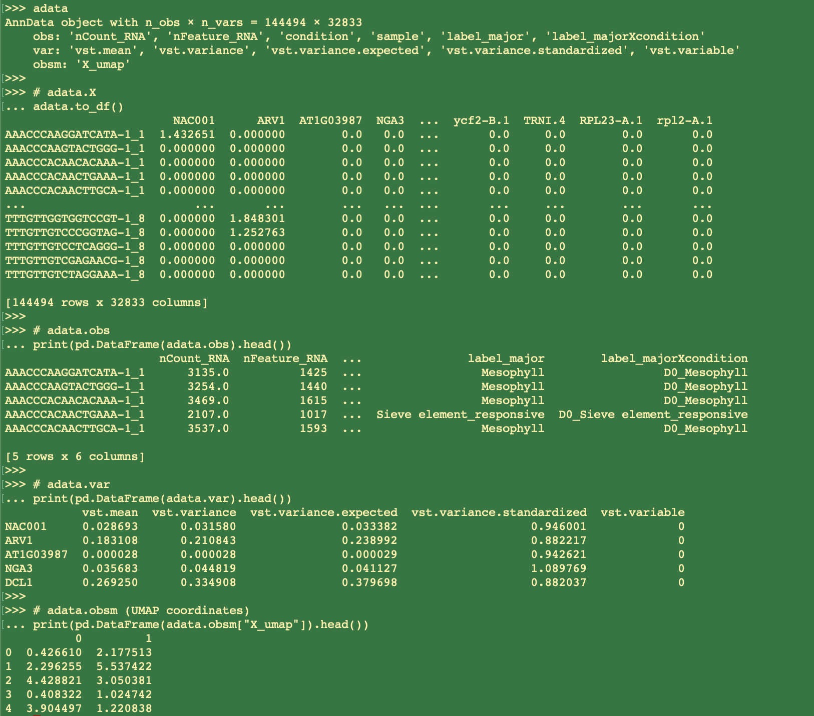

Converting Seurat to h5ad
================
Kathryn Lande
2026-03-23

``` r
# necessary libraries
library(Seurat)
library(SeuratDisk)

# example Seurat object to export to h5ad:
Seurat <- readRDS("/path/to/example.rds")
```

## Understanding the Main Components of Single Cell h5ad Format

Anndata objects contain very similar information as Seurat objects, but
actually converting the **correct** layers of a Seurat object into
Anndata can be a challenge.

#### A minimal single cell h5ad generally has this architecture:

``` python
# Openning and viewing an example AnnData object in python:
import scanpy as sc
import pandas as pd

adata = sc.read("/path/to/example.h5ad")
adata

# adata.X
adata.to_df()

# adata.obs
print(pd.DataFrame(adata.obs).head())

# adata.var
print(pd.DataFrame(adata.var).head())

# adata.obsm (UMAP coordinates)
print(pd.DataFrame(adata.obsm["X_umap"]).head())
```



- **adata.X:** The main sparse (cell x gene) matrix, *One layer of one
  <Seurat@assay> slot*
- **adata.obs:** cell meta data, *<Seurat@meta.data>*
- **adata.var:** vst stats on each gene
- **adata.obsm:** dimentionality reductions *from <Seurat@reductions>*

**Note:** While anndata objects *can* contain multiple layers of sparse
matrices, current export options with SeuratDisk only allow us to export
a single assay layer at a time. This tutorial will go over how to select
the correct layer. Multiple adata objects can be subsequently combined
to achieve a multi-layered object if desired.

## Selecting the Correct Layer to Export

SeuratDisk’s *SaveH5Seurat()* and *Convert()* functions will by default
use the DefaultAssay for adata.X. Within the DefaultAssay,
*SaveH5Seurat()* will choose layers by their availability, ranking them
as: **scale.data \> data \> counts.** *e.g., a scale.data layer will
always supersede a data layer, unless the assay is missing the scale.data
layer.*

To use the data layer of a specific assay that also contains a
scale.data assay, set it to your DefaultAssay and then remove the other
layers:

``` r
tmp <- Seurat # make a temporary copy of your main object
tmp[["RNA"]] <- as(object = tmp[["RNA"]], Class = "Assay")
DefaultAssay(tmp) <- "RNA" # set default assay to RNA
tmp@assays$RNA$scale.data <- NULL # remove scale.data layer
tmp@assays$RNA$counts <- NULL # remove counts layer (speeds up export times)
```

**Important note:** if your default assay was used for clustering, you
will not be able to export your umap if you remove the scale.data layer.
To get around this, create a dummy copy of your main assay and use it
instead. As long as the original scale.data layer is present in a
different assay slot, it will still export. For example”

``` r
tmp <- Seurat # make a temporary copy of your main object
tmp[["RNA_dummy"]] <- as(object = tmp[["RNA"]], Class = "Assay")
DefaultAssay(tmp) <- "RNA_dummy" # set default assay to RNA
tmp@assays$RNA_dummy$scale.data <- NULL # remove scale.data layer
tmp@assays$RNA_dummy$counts <- NULL # remove counts layer (speeds up export times)
```

## Removing Unnecessary Data

You can also remove some unnecessary data to shrink the size of the
final h5ad, e.g. to keep only the UMAP reduction and select meta data
columns:

``` r
tmp@meta.data <- tmp@meta.data[c(2,3,7,8,12,13)] # remove unnecessary meta.data columns
tmp@reductions$pca <- NULL # remove PCA reduction
tmp@reductions$tsne <- NULL # remove tsne reduction
tmp[["umap"]]@misc <- list() # remove misc from UMAP assay
```

## Reformatting Meta Data

Factors in your meta.data may export as numeric, so ensure all character
columns in the meta.data are set to characters prior to exporting:

``` r
# E.g.;
tmp@meta.data$label_major <- as.character(tmp@meta.data$label_major)
tmp@meta.data$label_majorXcondition <- as.character(tmp@meta.data$label_majorXcondition)
```

## Export to h5ad

``` r
SeuratDisk::SaveH5Seurat(tmp, filename = "RNAassay.h5Seurat", overwrite = T) # converts Seurat to h5Seurat
SeuratDisk::Convert("RNAassay.h5Seurat", dest = "h5ad", overwrite = T) # converts h5Seurat to h5ad
```
