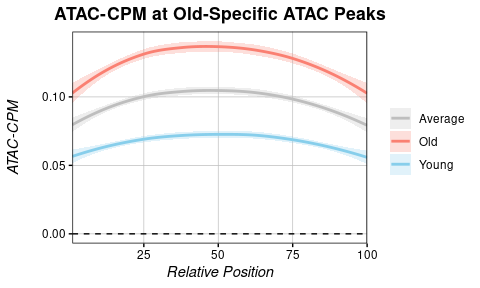

Whole Genome Analyses in R
================
Kathryn Lande
1 April 2026

## Load libraries

``` r
library(PCBS)
library(data.table)
```

<h1 align="center">Data Prep</h1>

Continuous whole genome information (ATAC, CUT&RUN, ChIPseq, etc), is
burdonsome to work with in R due to its size. Here we provide some
scripts adapted from PCBS’s WGBS framework to create and work with
indexed files that speed up analysis dramatically.

To start, we need to pull data from the alignment files. We can use
multiBamSummary from deeptools to get values in .bed format, which can
subsequently be indexed for analysis.

PCBS’s framework reduces memory load in two ways: 
* Firstly, it orders and indexes values by chromosome, 
making it very quick to pull values across specific region(s).
* Secondly, for continuous datasets like ATAC or ChIP, instead 
of including a value at every base, it samples sites discretely 
at a user-defined interval. 

When looking at larger
regions (hundreds or thousands of bp in length), this becomes
negligible. However, **resolution will be affected by this if you intend
to examine very small areas (\>a few hundred bp).** In this example, we
are using intervals of 20bp for sampling.

<h3 align="center">Extract Data from Bam(s) using Deeptools</h3>

``` bash
# tested in BASE on pilsner

# Count reads at intervals of 20bp:
multiBamSummary bins \ # calculate values in bins
  --bamfiles old8.bam yng9.bam \ # list all bam files to used
  -p 16 \ # nThreads
  --outRawCounts results.tsv \
  -bs 20 \ # bin size = 10bp; we will use indices of 10
  --minMappingQuality 30 \ # ignore low quality reads
  --ignoreDuplicates \ # ignore duplicate reads
  --blackListFileName mm10_blacklist_telocentro_contig.bed # genomic regions to remove
```

**Note on blacklist regions:** you will conserve a massive amount of memory if 
you discard telomeric, centromeric, contig, and otherwise blacklisted regions
prior to running multiBamSummary. The standard one I use for mm10 is
[here]("https://github.com/katlande/IGC_SOPs/blob/main/plaintext_assets/mm10_blacklist_telocentro_contig.bed"), but contigs in particular should be customized by version.


When we open the output file, *results.tsv*, it looks like this:

``` bash
head results.tsv
#'chr'  'start'          'end'            'old8.bam'  'yng9.bam'
# 12    96422196          96422216        0.0         0.0
# 12    96422216          96422236        0.0         0.0
# 12    96422236          96422256        0.0         0.0
```

The first 3 columns are genomic indices, and the subsequent columns are
the number of reads detected across each 20bp interval. For most
datatypes, we can normalize each sample by counts per bin per million
for plotting purposes. Note that if you subsequently compare other data
sets, you should ensure they have the same bin size for the normalized
value to be meaningful.

**NOTE: It is recommended to run the next few steps (normalization and
initial chromDict setup) interactively due to long processing times.
This is the a memory intensive step that is intended to save time down
the road. chromDicts can be saved as RDS files**

<h3 align="center">Normalize Samples by CPM/bin</h3>

``` r
res <- read.delim("results.tsv", comment.char = "#", header=F)
binsize <- 20 # binsize used in multiBamSummary

# normalize:
res[4:ncol(res)] <- 
  apply(res[4:ncol(res)], 2, function(x){
  return((as.numeric(x)/sum(as.numeric(x)))*1e06) # counts per bin per million
})

# Add column names to res:
colnames(res) <- c("chr", "start", "end", "old8", "yng9")
# add a single position for each bin at the centerpoint:
res$pos <- res$start + as.integer(binsize*0.5)
# remove start and end from res:
res <- res[c(1,ncol(res),4:(ncol(res)-1))]

#head(res)
##  chr      pos       old8   yng9
##    2 46226710 0.01863083    0
##    2 46226730 0.01863083    0
##    2 46226750 0.01863083    0
##    2 46226770 0.01863083    0
##    2 46226790 0.00000000    0
##    2 46226810 0.00000000    0
```

<h1 align="center">Converting to Genomic Indices</h1>

There are two options for genomic index files:
* A single index that takes an average across all samples of one condition
* One index per sample

Averaging across conditions will reduce the computation load by a lot,
especially if there are many samples, however some information is of
course lost this way. Below will be demonstrations on how to do this
both ways.

<h2 align="center">Modified chromDict() Function</h2>

PCBS makes chromDict Objects for WGBS data. While the base function is
designed specifically for use with methylation data, we can make minor
modifications to this function to extend it to other datatypes.

``` r
# general purpose chromDict function
chromDictAny <- function(mat, IDs=NULL, multiple.samples=T, remove.extra=T, n.autosome=22){
  
  # set first two column names to "chr" and "pos"
  colnames(mat)[1:2] <- c("chr", "pos")
  
  if(multiple.samples){
     message("Calculating mean value differences...")
    if(length(IDs) == 1){
      mat$value <- rowMeans(mat[which(grepl(IDs, colnames(mat)))])
    } else {
      mat$value <- rowMeans(mat[which(colnames(mat) %in% IDs)])
    }
  
  } else {
    message(paste("Extracting values for sample:", IDs))
    if(length(IDs) > 1){
      warning("Cannot have multiple IDs when multiple.samples=FALSE!")
      stop()
    }
    # VAL column is just the column of interest
     mat$value <- mat[[which(colnames(mat) == IDs)]]
  }
  
  # create a master data.frame of bp chrom, pos, and value:
  mat$cpgID <- paste0(mat$chr, ":", mat$pos)
  row.names(mat) <- mat$cpgID
  diffdf <- mat[, c("chr", "pos", "value")]
  
   # if specified, remove any contig or chromosome other than autosomes and sex chromosomes. Note that this will NOT WORK in genome versions that use abnormal chromosome nomenclature, and is designed for human and mouse: 
  if(remove.extra){
    allchrnames <- unique(diffdf$chr)
    allchrnames_strip <- gsub("chr", "", allchrnames, ignore.case = TRUE)
    keep.chrnames <- allchrnames[which(allchrnames_strip %in% c(1:n.autosome, "x", "y", "X", "Y"))]
    # only subset if there are actually chromosomes present to remove:
    if(! identical(allchrnames, keep.chrnames)){
      message(paste("Removing", (length(allchrnames)-length(keep.chrnames)), "abnormal chromosomes/contigs..."))
      diffdf <- subset(diffdf, chr %in% keep.chrnames)
    } else {
      message("No abnormal chromosomes/contigs found!")
    }
  }
  
  # split by chromosome and order+index with data.table
  outlist <- list()
  message("Splitting by chromosome...")
  for(i in unique(as.character(diffdf$chr))){
    message(i)
    d <- diffdf[diffdf$chr==i,]
    d$pos <- as.numeric(d$pos)
    d <- d[order(d$pos),]
    data.table::setDT(d)
    data.table::setkey(d,pos)
    outlist <- append(outlist, list(d))
  }
  
  names(outlist) <- unique(as.character(diffdf$chr))
  return(outlist)
}
```

<h2 align="center">Averaged Sample chromDict</h2>

Make a chromDict used the averaged CPM/bin values across the two (or more) input samples.
``` r
avg_chromDict <- chromDictAny(res, IDs=c("old8", "yng9"), multiple.samples=T)
saveRDS(avg_chromDict, "SampleAvg_ChromDict.rds")
```

<h2 align="center">Individual Sample chromDicts</h2>

Make a separate chromDict for each sample.
``` r
old8_chromDict <- chromDictAny(res, "old8", multiple.samples=F)
saveRDS(old8_chromDict, "Old8_ChromDict.rds")

yng9_chromDict <- chromDictAny(res, "yng9", multiple.samples=F)
saveRDS(yng9_chromDict, "Yng9_ChromDict.rds")
```

Now the computationally heavy bits are done, and we can read our
dictionaries back into R for plotting:

``` r
old8_chromDict <- readRDS("Old8_ChromDict.rds")
yng9_chromDict <- readRDS("Yng9_ChromDict.rds")
avg_chromDict <- readRDS("SampleAvg_ChromDict.rds")

# look at the tail of chromosome 10 to compare cpm values of old only, young only, and combined:
setNames(data.frame(cbind(tail(old8_chromDict$`10`), 
                          tail(yng9_chromDict$`10`[[3]]),
                          tail(avg_chromDict$`10`[[3]]))), 
         c("Chr", "Pos", "Old8", "Yng9", "Avg"))
```

    ##   Chr       Pos       Old8       Yng9        Avg
    ## 1  10 130541890 0.01863083 0.02155326 0.02009204
    ## 2  10 130541910 0.07452333 0.08621303 0.08036818
    ## 3  10 130541930 0.16767749 0.17242605 0.17005177
    ## 4  10 130541950 0.31672414 0.32329885 0.32001149
    ## 5  10 130541970 0.35398580 0.36640536 0.36019558
    ## 6  10 130541990 0.33535497 0.40951187 0.37243342

<h1 align="center">Figure Making</h1>

Subsequent figures can be made relatively easily following PCBS
frameworks. For example, meta genes across known age-differential ATAC
peaks:

``` r
# Read in ATAC peak regions:
known_peaks <- read.delim("/path/to/some/DiffPeaks_old.bed", header=F)
known_peaks$V1 <- gsub("chr", "", known_peaks$V1) # remove "chr" to match formatting of dicts
known_peaks <- known_peaks[known_peaks$V1 %in% c(1:19,"X","Y"),] # remove filtered chromosomes -- including them will cause errors
head(known_peaks[1:3])
```

    ##   V1       V2       V3
    ## 1  1  8467449  8467589
    ## 2  1  8822024  8822252
    ## 3  1 12718393 12718551
    ## 4  1 13531580 13531730
    ## 5  1 23173537 23173673
    ## 6  1 26262742 26262952

``` r
# extract metagene data for each chrom dict:
# the methylDiff_metagene() is from PCBS, but does not explicitly need to be used with methylation data.
metagene_avg <- methylDiff_metagene(avg_chromDict, known_peaks, return.data = T, value = "value")
metagene_yng9 <- methylDiff_metagene(yng9_chromDict, known_peaks, return.data = T, value = "value")
metagene_old8 <- methylDiff_metagene(old8_chromDict, known_peaks, return.data = T, value = "value")

multiple_metagenes(data_list = list(metagene_avg, metagene_yng9, metagene_old8), # list of raw data
                   set_names = c("Average", "Young", "Old"), # names for elements of the data_list list
                   col=c(Average="grey", Young="skyblue", Old="salmon"), # colours for metagenes
                   title="ATAC-CPM at Old-Specific ATAC Peaks",
                   legend.title = F, 
                   yaxis = "ATAC-CPM")
```

<p align="center"></p>
